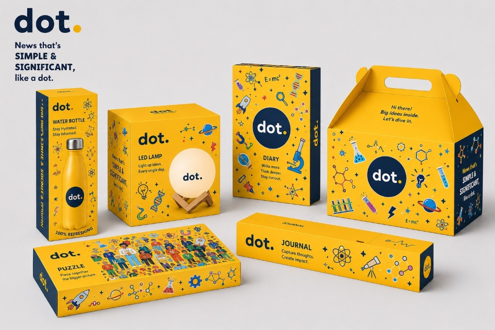

# 🟡 Dot Merchandise Showcase | Inkling 2026



Welcome to the **Dot Merchandise Case Study** repository! This project was developed as a comprehensive digital showcase for the **IIM Ranchi x dot. Inkling 2026 National Case Competition (Round 2)**.

## 🎯 The Challenge: Merch That Matters

### Context
Great merchandise is a subtle extension of a brand's identity - it shouldn't feel like advertising. It reflects what a brand stands for, builds a sense of belonging for its owner, and helps others discover the brand organically. At Dot, the goal is to express their unique educational philosophy through merchandise that people would genuinely love to carry.

### The Problem Statement
> *Design a merchandise collection of up to 15 designs (across T-shirts, tote bags, notebooks, mugs, laptop sleeves, sippers, coasters or more) that reinforces Dot's identity and stays true to its values.*

The objective was to think beyond simply slapping a logo on products. The merchandise had to capture the spirit of Dot in fun and creative ways - feeling **timeless, desirable, and distinctly "Dot"**. It needed to strengthen brand affinity among "Dotties" while introducing new people to the brand through everyday use.

---

## 💡 Our Solution: The "Think Everyday" Collection

We didn't just design merchandise; we built an immersive digital experience to showcase the **"Think Everyday"** collection. 

We transformed 15 everyday essentials into subtle reminders to explore and stay curious. Every product in this showcase goes beyond physical utility - it acts as a portal. By scanning the QR codes seamlessly integrated into the designs, users unlock unique, hand-picked educational articles from around the world.

### Key Highlights of the Showcase:
* 🎨 **Premium Aesthetic & Interactive UI:** A highly polished, dynamic Next.js application featuring modern typography, scroll-based animations, and responsive asymmetrical grids.
* 🛍️ **Interactive Product Galleries:** 3D video integrations, dynamic image toggles, and beautiful nested layouts for deep product exploration.
* 📱 **The "QR Connected" Concept:** Highlighting the core innovation - merch that bridges the physical and digital learning experience.
* 📖 **Story-Driven Presentation:** Every illustration, doodle, and design is presented with its underlying story and meaning, staying true to Dot's educational identity.

## 🛠️ Tech Stack

This showcase was built with a modern web stack designed for performance, fluidity, and aesthetics:
* **Framework:** Next.js (React)
* **Animation:** Framer Motion (for scroll reveals, hover states, and micro-interactions)
* **Styling:** Custom CSS architectures focused on premium typography, deep contrast, and glassmorphism elements.

## 🚀 Running Locally

Want to explore the showcase on your own machine? 

1. **Clone the repository:**
   ```bash
   git clone https://github.com/Mehtarishita/dot-merch-case-study.git
   ```
2. **Install dependencies:**
   ```bash
   npm install
   ```
3. **Start the development server:**
   ```bash
   npm run dev
   ```
4. **Explore:** Open [http://localhost:3000](http://localhost:3000) in your browser to experience the showcase.

---
*Designed & Developed for the IIM Ranchi x dot. Inkling 2026 Case Competition.*
